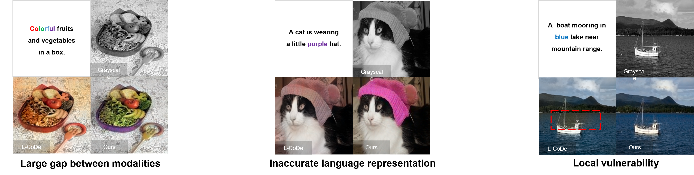

# L-CoDer: Language-based Colorization with Color-object Decoupling Transformer

## Abstract
Language-based colorization requires the colorized image to be consistent with the the user-provided language caption. A most recent work proposes to decouple the language into color and object conditions in solving the problem. Though decent progress has been made, its performance is limited by three key issues. (i) The large gap between vision and language modalities using independent feature extractors makes it difficult to fully understand the language. (ii) The inaccurate language features are never refined by the image features such that the language may fail to colorize the image precisely. (iii) The local region does not perceive the whole image, producing global inconsistent colors. In this work, we introduce transformer into language-based colorization to tackle the aforementioned issues while keeping the language decoupling property. Our method unifies the modalities of image and language, and further performs color conditions evolving with image features in a coarse-to-fine manner. In addition, thanks to the global receptive field, our method is robust to the strong local variation.


 


## Prerequisites
* Python 3.6
* PyTorch 1.10
* NVIDIA GPU + CUDA cuDNN

## Installation
Clone this repo: 
```
git clone https://github.com/changzheng123/L-CoDer.git
```
Install PyTorch and dependencies
```
http://pytorch.org
```
Install other python requirements
```
pip install -r requirement.txt
```

## Extended COCO-Stuff Dataset

We process the [MSCOCO](https://cocodataset.org/) dataset for evaluation. Specifically, we keep the images whose captions contain adjectives and annotate the correspondence between adjectives and nouns in the caption to produce the ground-truth object-color corresponding matrix (OCCM). Metadata is in ``./resources``.

## Testing with pretrained model

Download pre-trained models [here](https://drive.google.com/file/d/1xA-4hzY-zBxtxywVw_9y2u17ExenRVju/view?usp=drive_link), and run:
```
  python run_colorization.py --model  colorization_vit_large_patch16_224_fusion_whole_up --data_path <your data path> --finetune checkpoint/largedecoder-checkpoint.pth --batch_size 2 --eval --output_dir output/test
```

## License
Licensed under a [Creative Commons Attribution-NonCommercial 4.0 International](https://creativecommons.org/licenses/by-nc/4.0/).

Except where otherwise noted, this content is published under a [CC BY-NC](https://creativecommons.org/licenses/by-nc/4.0/) license, which means that you can copy, remix, transform and build upon the content as long as you do not use the material for commercial purposes and give appropriate credit and provide a link to the license.

## Citation
If you use this code for your research, please cite our papers [L-CoDer: Language-based Colorization with Color-object Decoupling Transformer](https://ci.idm.pku.edu.cn/Weng_ECCV22g.pdf)
```
@InProceedings{lcoder,
  author = {Chang, Zheng and Weng, Shuchen and Li, Yu and Li, Si and Shi, Boxin},
  title = {L-CoDer: Language-based Colorization with Color-object Decoupling Transformer},
  booktitle = {{ECCV}},
  year = {2022}
}
```
